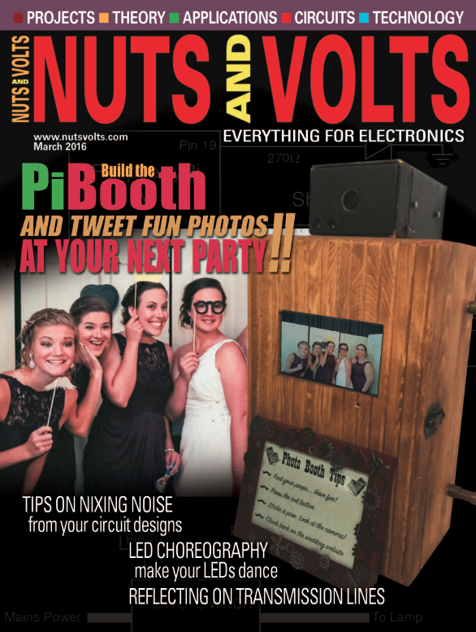

# PiBooth

Raspberry Pi photobooth project. This is a simple photobooth built for my
wedding that allowed guests to take a series of photos with on-screen
countdown timer, external lighting control, camera sounds, and optional
automatic tweeting of photos with snarky comments.

This project was published in the electronics magazine "Nuts and
Volts" as well, so be sure to checkout that article if you are interested in
the step-by-step hardware build. Hookup is straight forward and documented in
the code as well.

